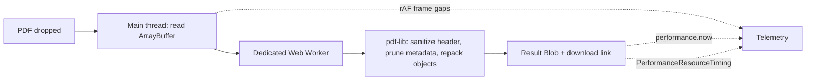

<div align="center">

# Abhinav Deval

**Systems & Cloud-Native Software Engineer**

B.Tech ECE at IIIT Kalyani (Class of 2029) · CNCF Meshery contributor · GSSoC '26 Global Rank #111

[**Portfolio →**](https://abhinavkdeval.vercel.app) · [**EnclavePDF (live) →**](https://enclave-pdf.vercel.app) · [**EnclavePDF (repo) →**](https://github.com/abhinavkdeval08-design/EnclavePDF)


</div>

<!-- Add a screenshot or GIF at docs/preview.png, then uncomment: -->
<!--  -->

## What this is

My personal portfolio, built as a small product instead of a static page. The centerpiece is an embedded **live demo of EnclavePDF**, my zero-egress, in-browser PDF compression engine. Drop a PDF and a Dedicated Web Worker compresses it entirely on your machine, with the results measured on the spot.

## EnclavePDF

| | Portfolio demo (this repo) | [EnclavePDF app](https://enclave-pdf.vercel.app) |
|---|---|---|
| **Purpose** | Small, inspectable proof of the approach | Standalone production tool |
| **Pipeline** | Lossless structure and metadata pruning | Dual pipeline: lossless, plus dynamic rasterization via `OffscreenCanvas` |
| **Scanned PDFs** | May barely shrink | Rasterization path, with a 16M px guard |
| **Source** | `app/compress.worker.ts` | [github.com/abhinavkdeval08-design/EnclavePDF](https://github.com/abhinavkdeval08-design/EnclavePDF) |

**Honest limits.** The embedded demo does lossless pruning only. It never re-encodes images, so savings vary, and already-optimized or scanned PDFs may barely shrink. Lossy rasterization lives in the full app.

## Highlights

- **Live in-browser PDF compression.** A Dedicated Web Worker (`compress.worker.ts`) runs `pdf-lib` to prune metadata and repack objects off the main thread. It also sanitizes binary headers to handle malformed output from scanner apps such as CamScanner. A "Load sample PDF" button generates a test file, so nothing needs to be uploaded.
- **Measured, not claimed.** After each run the page reports:
  - size before and after
  - worker time
  - longest frame, checked against the 16 ms budget, to show the main thread stayed responsive (`requestAnimationFrame` gaps)
  - outbound network requests, read from the `PerformanceResourceTiming` API (expected: 0)
- **⌘K / Ctrl+K command palette.** Jump between sections, copy my email, or open any profile with the keyboard.
- **Cheap interactions.** The card spotlight updates CSS variables directly on the DOM node, so mouse movement causes no React re-renders. The live IST clock sits in its own memoized component, so it ticks without re-rendering the page.
- **Accessible by default.** Keyboard focus rings, `aria` labels, and `prefers-reduced-motion` support for both CSS and Framer Motion animations.

## How the demo works



**Measurement caveat.** The egress figure comes from the main thread's resource timing, which does not observe requests made inside the worker. That is why the worker contains no `fetch` calls, which you can verify in `compress.worker.ts`.

## Tech stack

Next.js (App Router) · React · TypeScript · Tailwind CSS · Framer Motion · Lucide · pdf-lib

## Project structure

```
app/
├── page.tsx             # The whole page: sections, live demo, command palette
├── compress.worker.ts   # Web Worker that does the PDF compression
├── layout.tsx           # Fonts and SEO metadata
└── globals.css
```

## Run locally

```bash
git clone https://github.com/abhinavkdeval08-design/Abhinav-Portfolio.git
cd Abhinav-Portfolio
npm install
npm run dev
```

Open [http://localhost:3000](http://localhost:3000).

Other scripts: `npm run build` for a production build, `npm run lint` for ESLint.

## Make it yours

All profile links and contact details live in the `LINKS` object at the top of `app/page.tsx`. Update the data arrays right below it (metrics, projects, arsenal) and the rest of the page follows.

## Deploy

Deployed on [Vercel](https://vercel.com). Push to `main` and it redeploys automatically.

## Contact

I am looking for Software Engineering and Systems internships for 2026–2027.

- Email: [abhinavkdeval08@gmail.com](mailto:abhinavkdeval08@gmail.com)
- LinkedIn: [linkedin.com/in/abhinavdeval](https://linkedin.com/in/abhinavdeval)
- GitHub: [abhinavkdeval08-design](https://github.com/abhinavkdeval08-design)
- LeetCode: [abhinav_deval07](https://leetcode.com/u/abhinav_deval07/)
- Codeforces: [abhinavkdeval29](https://codeforces.com/profile/abhinavkdeval29)
